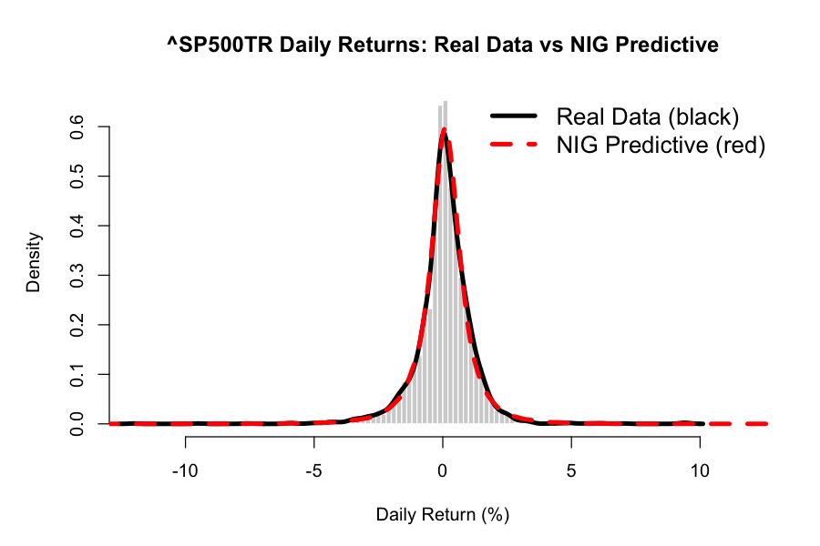

```markdown
# Bayesian Heteroscedastic NIG Model for Tail Risk

**Bayesian Normal Inverse Gaussian (NIG) implementation** using MCMC Gibbs sampling for modeling equity returns and improving Value-at-Risk (VaR) estimates.

Based on the heteroscedastic extension from **Karlis & Lillestøl (2004)** with full posterior predictive sampling.

---

## Why NIG?

Traditional risk models rely on the **Normal distribution**, which dangerously underestimates fat tails and extreme events in financial markets.

The NIG distribution solves this by naturally capturing:
- Heavy tails (leptokurtosis)
- Asymmetry (skewness)
- Stochastic volatility per observation (heteroscedastic)

---

## Key Results — ^SP500TR Daily Returns (2015–2025)

| Metric                  | Real Data   | NIG Model     | Normal Model |
|-------------------------|-------------|---------------|--------------|
| **1% VaR (1-day)**      | -3.321%     | **-3.377%**   | -2.596%      |
| **5% Expected Shortfall**| -2.770%     | **-2.753%**   | -2.279%      |
| **Kurtosis**            | 15.51       | 8.51          | 3.00         |

**Key Takeaway**: The NIG model significantly outperforms the Normal benchmark on critical tail-risk metrics (especially 1% VaR and Expected Shortfall), providing more realistic and conservative risk estimates.



---

## Model Specification

Heteroscedastic NIG regression:

```math
y_i | z_i \sim N(\mu + \beta z_i, z_i)
z_i \sim IG(\gamma, \delta)
```

Each observation has its own latent variance `z_i` (stochastic volatility).

**Parameters**:
- `γ` — tail heaviness (smaller = fatter tails)
- `β` — skewness
- `δ` — scale

---

## Methodology

- **Estimation**: Gamma-GIG scheme with data augmentation (Karlis & Lillestøl 2004)
- **MCMC**: 500,000 iterations (150k burn-in, thinned by 200)
- **Priors**: Weak informative (`omega = 1`, `eta = var(y)`)
- **Sampling**: Full posterior predictive (not point estimates)

**Convergence**: Excellent mixing on gamma (tail heaviness) parameter.

---

## Future Extensions (Planned)

- Add covariates (e.g. VIX) for conditional VaR forecasting
- In-sample vs out-of-sample backtesting
- Test on individual stocks and other asset classes
- Multivariate NIG for portfolio risk

---

## Repository

- `garc.R` — Main implementation script
- `NIG_vs_Real_Density.png` — Chart for LinkedIn/GitHub

---

## References

Karlis, D. & Lillestøl, J. (2004). Bayesian estimation of NIG models via Markov chain Monte Carlo methods. *Applied Stochastic Models in Business and Industry*, 20(4), 323–338.

---

**Last updated**: March 2026  
**Author**: Scuplex
```